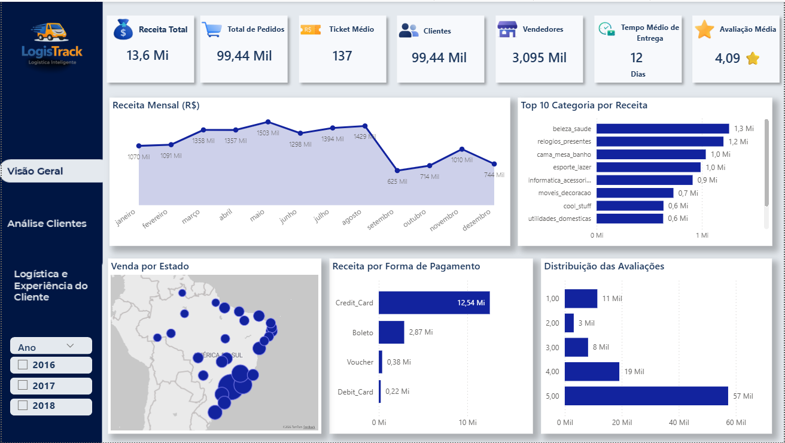

# 📊 E-commerce Analytics Dashboard

Projeto de **Business Intelligence** desenvolvido para análise de desempenho de um marketplace de e-commerce utilizando dados públicos da Olist.

Este projeto faz parte do meu **portfólio profissional em Data Analytics**, demonstrando habilidades em **SQL, modelagem de dados, análise exploratória e construção de dashboards analíticos utilizando Power BI**, transformando dados brutos em insights estratégicos de negócio.

---

# 🎯 Objetivo do Projeto

Analisar o desempenho de um marketplace de e-commerce sob diferentes perspectivas de negócio:

- Performance de vendas
- Comportamento dos clientes
- Eficiência logística
- Experiência do consumidor

A análise busca gerar **insights estratégicos para apoiar a tomada de decisão baseada em dados**.

---

# 🗂 Dataset Utilizado

Dataset público:

**Brazilian E-Commerce Public Dataset by Olist**

Fonte: Kaggle

O dataset contém informações reais de pedidos realizados em marketplaces brasileiros entre os anos de 2016 e 2018.

Principais informações disponíveis no dataset:

- Pedidos
- Clientes
- Produtos
- Vendedores
- Pagamentos
- Avaliações
- Logística de entrega

---

# 🛠 Ferramentas Utilizadas

- Power BI
- SQL
- Python (Anaconda / Jupyter)
- Kaggle Dataset
- Modelagem de Dados
- DAX

---

# 📊 Estrutura dos Dashboards

O projeto foi organizado em **3 camadas principais de análise**, permitindo entender o negócio sob diferentes perspectivas.

---

# 1️⃣ Visão Geral do E-commerce

Dashboard executivo com indicadores estratégicos do marketplace.

### KPIs

- Receita Total
- Total de Pedidos
- Ticket Médio
- Total de Clientes
- Total de Vendedores
- Tempo Médio de Entrega
- Avaliação Média

### Análises

- Evolução mensal da receita
- Top categorias de produtos
- Distribuição geográfica das vendas
- Métodos de pagamento
- Distribuição das avaliações

---

# 2️⃣ Análise de Clientes

Dashboard focado no comportamento da base de clientes.

### KPIs

- Total de Clientes
- Receita por Cliente
- Pedidos por Cliente
- Ticket Médio por Cliente

### Análises

- Clientes por estado
- Ticket médio por região
- Crescimento da base de clientes ao longo do tempo
- Frequência de compra

### Insight

A análise mostra que **a maioria dos clientes realiza apenas uma compra**, indicando baixa recorrência e potencial para estratégias de retenção e fidelização.

---

# 3️⃣ Logística e Experiência do Cliente

Dashboard focado na eficiência logística e impacto na satisfação do cliente.

### KPIs

- Tempo Médio de Entrega
- Pedidos Atrasados
- % Entregas no Prazo
- Avaliação Média

### Análises

- Tempo médio de entrega por estado
- Distribuição do tempo de entrega
- Impacto do atraso na avaliação

### Insight

Pedidos entregues com atraso apresentam **avaliações significativamente menores**, evidenciando o impacto direto da logística na experiência do cliente.

---

# 📊 Principais Insights

Alguns dos principais insights identificados na análise:

- O marketplace gerou aproximadamente **R$13,6 milhões em receita**
- Foram registrados cerca de **99 mil pedidos**
- O **ticket médio é de aproximadamente R$137**
- A maioria dos clientes realiza **apenas uma compra**
- A região Sudeste concentra a maior parte das vendas
- O **cartão de crédito é o método de pagamento predominante**
- Aproximadamente **92% das entregas são realizadas dentro do prazo**
- Pedidos atrasados reduzem significativamente a avaliação dos clientes

---

# 📊 Dashboard Power BI

O dashboard completo em **Power BI** pode ser acessado no link abaixo:

👉 **Download do Dashboard Power BI (.PBIX)**

https://drive.google.com/file/d/1Kr2501ubEx2E0K7N9g71pdCxhBLW78D0/view?usp=sharing

Abra o arquivo utilizando o **Power BI Desktop** para explorar todas as análises e interações do dashboard.

---

# 📷 Visualização dos Dashboards

## Visão Geral

---

## Análise de Clientes

---

## Logística e Experiência do Cliente

---

# 💡 Competências Demonstradas

Este projeto demonstra habilidades em:

- Business Intelligence
- Data Analytics
- SQL para análise de dados
- Modelagem de dados
- Criação de métricas em DAX
- Data Visualization
- Storytelling com dados
- Análise de comportamento do consumidor
- Análise logística

---

# 👨‍💻 Autor

**Weslley Marques**

Profissional formado em **Sistemas de Informação**, com foco em **Business Intelligence, Data Analytics e Data Visualization**.

Este projeto faz parte do meu portfólio de análise de dados, demonstrando habilidades em **SQL, modelagem de dados, criação de dashboards e geração de insights para tomada de decisão**.

